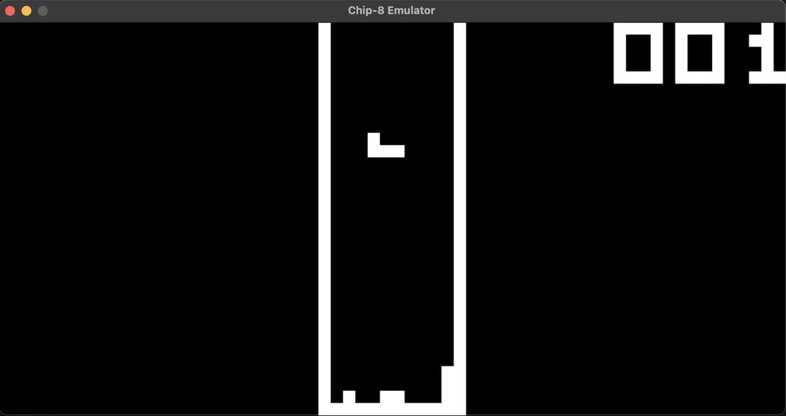

# Rust CHIP-8 Emulator
This is an emulator for the CHIP-8 in Rust, adapted from [Austin Morlen's](https://code.austinmorlan.com/austin/2019-chip8-emulator) CHIP-8 Emulator. Credit goes to him!



## Installation Instructions
1. Install Rust and SDL2 on your computer.
2. Clone this repository.
3. Run ```cargo run <Scale> <Time Delay> <ROM Path>```, for example ```cargo run 15 2 tetris.ch8```.
4. Enjoy!